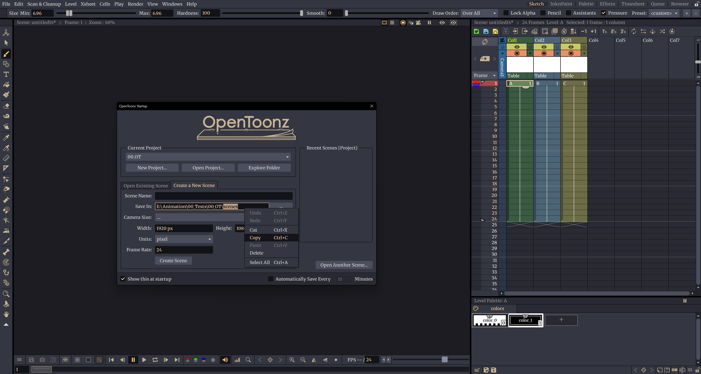

# Example

# Recommended Font & Color Settings
For the best visual experience with this theme, we recommend installing the **Merriweather** font from Google Fonts:

🔗 [Download Merriweather](https://fonts.google.com/specimen/Merriweather)

### Setup Instructions

1. **Install the Merriweather font** from the link above.
2. Open **File > Preferences > Interface** and set the font to **Merriweather**.
3. Restart the app to apply the font change.
4. Then go to **File > Preferences > Colors** and update the following:
   - **Viewer BG Color**: `28, 28, 34`
   - **Preview BG Color**: `18, 18, 24`
